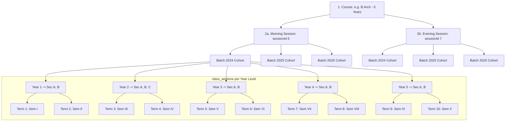
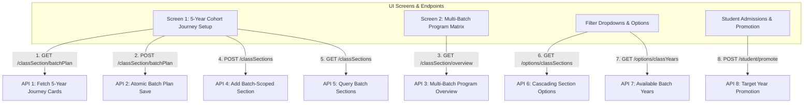

# Comprehensive Architecture & Migration Plan: Batch-Driven Class Sections, Terms & Standing Sessions

---

## 1. Executive Summary & Core Objective

The university system is transitioning from a transient calendar-year model (`academicYearId`) to a **Batch-Driven Cohort Journey Model** (`batch` + `year`) for `class_sections` and standing delivery tracks (`session`).

### Key Business Goals:
1. **Multi-Year Batch Journey (Screen 1):** For a multi-year program (e.g., B.Arch 5 Years, B.Tech 4 Years), sections for all stages (`Year 1` to `Year N`) can be configured for a batch (e.g. Batch 2024, 2025, 2026). A transient calendar `academicYearId` (e.g., 2026) will no longer block viewing or configuring past or upcoming years of a cohort.
2. **Multi-Batch Coexistence (Screen 2):** Under each **Program · Session** (e.g., `B.Arch · Morning Session`), multiple active batches (2024, 2025, 2026) run simultaneously at different year levels (Year 3, Year 2, Year 1).
3. **Multi-Session Scaling (Morning & Evening Sessions):** An institution that ran a single session (`Session 01`) in 2024/2025 can seamlessly introduce dual sessions (`Morning Session` and `Evening Session`) in 2026 for all batches without any data conflicts or foreign key issues.
4. **Seamless Student Promotion:** Future year sections already exist in the database. When promoting Batch 2026 students from Term 2 (Sem II) to Term 3 (Sem III / Year 2), the system maps them directly to the pre-existing Year 2 section without requiring duplicate section recreation each year.
5. **Zero Data Loss for 2024, 2025 & 2026 Records:** Existing primary keys (`class_sections_id`, `class_section_term_id`, `session_id`) remain 100% intact, guaranteeing that attendance records, timetable slots, student enrollment histories, and exam results never break.

---

## 2. Entity Model & Architectural Hierarchy



---

## 3. Core Database Entities & Model Impact Analysis

| Table / Model | DB Schema Changes | Data Backfill Strategy | Scope Configuration (`scopeConfig`) |
|---|---|---|---|
| **`class_sections`** ([classSectionModel.js](file:///c:/Users/gaura/Downloads/warrdel_git_repos_clone_folder/university-be/models/classSectionModel.js)) | **1. Add `batch INT NOT NULL`<br>2. Drop `acedmic_year_id`** | Backfill $\text{batch} = \text{AY} - \text{year} + 1$ from existing linked academic years | Change to `{ university: false, institute: true, academicYear: false }` |
| **`class_section_term`** ([classSectionTermModel.js](file:///c:/Users/gaura/Downloads/warrdel_git_repos_clone_folder/university-be/models/classSectionTermModel.js)) | **ZERO Changes** | **None** (Foreign keys point to `class_sections_id`) | Already `{ university: true, institute: true, academicYear: false }` |
| **`session`** ([sessionModel.js](file:///c:/Users/gaura/Downloads/warrdel_git_repos_clone_folder/university-be/models/sessionModel.js)) | **ZERO Changes** | **None** (Sessions are persistent delivery tracks) | Change to `{ university: true, institute: true, academicYear: false }` |
| **`session_course_mapping`** ([sessionCouseMappingModel.js](file:///c:/Users/gaura/Downloads/warrdel_git_repos_clone_folder/university-be/models/sessionCouseMappingModel.js)) | **ZERO Changes** | **None** | Change to `{ university: true, institute: true, academicYear: false }` |

---

## 4. Deep-Dive: Handling the Multi-Session Scaling Scenario

### Scenario:
- In **2024 and 2025**, the university operated with a single default session: `Session 01` (`sessionId = 6`). Batch 2024 and Batch 2025 studied in Sections A & B under `sessionId = 6`.
- In **2026**, the university expands and introduces two shift tracks: `Morning Session` (`sessionId = 6`, renamed or kept) and `Evening Session` (`sessionId = 7`) for all active batches (2024, 2025, 2026).

### How is this managed in the Database?
Each `class_sections` row is uniquely identified by `(course_id, session_id, batch, year, section)`.

```
Course 34: B.Arch (5 Years)
│
├── ☀️ Morning Session (sessionId = 6)
│   ├── Batch 2024 (Year 3 in 2026): Section A (58 students), Section B (60 students)
│   ├── Batch 2025 (Year 2 in 2026): Section A (42 students), Section B (40 students), Section C (40 students)
│   └── Batch 2026 (Year 1 in 2026): Section A (60 students), Section B (60 students)
│
└── 🌙 Evening Session (sessionId = 7)
    ├── Batch 2024 (Year 3 in 2026): Section A (22 students), Section B (20 students)
    ├── Batch 2025 (Year 2 in 2026): Section A (21 students), Section B (21 students)
    └── Batch 2026 (Year 1 in 2026): Section A (30 students)
```

### Concrete Database Row Representation:
| `class_sections_id` | `session_id` | `batch` | `year` | `section` | Status in Academic Year 2026–2027 |
|---|---|---|---|---|---|
| **101** | **6 (Morning)** | **2024** | **3** | A | Active (58 students) |
| **102** | **6 (Morning)** | **2024** | **3** | B | Active (60 students) |
| **103** | **7 (Evening)** | **2024** | **3** | A | Active (22 students) |
| **104** | **7 (Evening)** | **2024** | **3** | B | Active (20 students) |
| **105** | **6 (Morning)** | **2025** | **2** | A | Active (42 students) |
| **106** | **6 (Morning)** | **2025** | **2** | B | Active (40 students) |
| **107** | **7 (Evening)** | **2025** | **2** | A | Active (21 students) |
| **108** | **6 (Morning)** | **2026** | **1** | A | Active (60 students) |
| **109** | **7 (Evening)** | **2026** | **1** | A | Active (30 students) |

### Student History & Transition Safety:
1. **Past Historical Data:** In 2024 and 2025, Batch 2024 students attended Year 1 and Year 2 under `session_id = 6`. Their past term registrations, attendance, and marksheets link to `class_section_term_id` records under those Year 1 & 2 sections. Those records remain permanently immutable in `student_class_sections_history`.
2. **2026 Shift Allocation:** When Batch 2024 enters Year 3 in 2026:
   - Students choosing the Morning track are enrolled into `class_sections_id = 101 / 102` (`session_id = 6`, `year = 3`).
   - Students choosing the Evening track are enrolled into `class_sections_id = 103 / 104` (`session_id = 7`, `year = 3`).
3. **No Cross-Pollution:** Morning and evening timetables, attendance registers, and faculties operate independently because their `class_section_term_id`s belong to distinct `class_sections` rows.

---

## 5. Cohort Year Progression Mathematics

Given:
- **`batch`**: Student admission intake year (e.g., `2024`)
- **`activeYear`**: Current calendar academic year start (e.g., `2026` for AY 2026–2027)

### Formulas:
$$\text{Current Program Year Level} = \text{activeYear} - \text{batch} + 1$$
$$\text{Calendar Year of Stage } Y = \text{batch} + Y - 1$$

### Active Batch Status Matrix in Academic Year 2026–2027:

| Batch | Calculation in 2026 | Year Level | Active Terms | Status in 2026 |
|---|---|---|---|---|
| **Batch 2022** | $2026 - 2022 + 1$ | **Year 5** | Sem IX & Sem X (Terms 9 & 10) | Active (Final Year) |
| **Batch 2023** | $2026 - 2023 + 1$ | **Year 4** | Sem VII & Sem VIII (Terms 7 & 8) | Active |
| **Batch 2024** | $2026 - 2024 + 1$ | **Year 3** | Sem V & Sem VI (Terms 5 & 6) | Active |
| **Batch 2025** | $2026 - 2025 + 1$ | **Year 2** | Sem III & Sem IV (Terms 3 & 4) | Active |
| **Batch 2026** | $2026 - 2026 + 1$ | **Year 1** | Sem I & Sem II (Terms 1 & 2) | Active (New Intake) |

---

## 6. Migration Strategy & Zero Data Loss Execution

### Step 1: SQL Migration Script

```sql
-- 1. Add `batch` column to class_sections
ALTER TABLE `class_sections` 
ADD COLUMN `batch` INT NULL AFTER `session_id`;

-- 2. Backfill `batch` from direct academic_year starting date
UPDATE `class_sections` cs
INNER JOIN `acedmic_year` ay ON cs.acedmic_year_id = ay.acedmic_year_id
SET cs.batch = (YEAR(ay.starting_date) - COALESCE(cs.year, 1) + 1)
WHERE cs.batch IS NULL;

-- 2b. Secondary backfill via session academic year if direct academic year was missing
UPDATE `class_sections` cs
INNER JOIN `session` s ON cs.session_id = s.session_id
INNER JOIN `acedmic_year` ay ON s.acedmic_year_id = ay.acedmic_year_id
SET cs.batch = (YEAR(ay.starting_date) - COALESCE(cs.year, 1) + 1)
WHERE cs.batch IS NULL;

-- 2c. Fallback for any orphaned edge cases
UPDATE `class_sections`
SET `batch` = 2026
WHERE `batch` IS NULL OR `batch` < 2000;

-- 3. Enforce NOT NULL and create composite performance index
ALTER TABLE `class_sections` 
MODIFY COLUMN `batch` INT NOT NULL,
ADD INDEX `idx_cs_course_session_batch_year` (`course_id`, `session_id`, `batch`, `year`);

-- 4. Drop Foreign Key constraint & acedmic_year_id column
ALTER TABLE `class_sections` 
DROP FOREIGN KEY `class_sections_acedmic_year_id_foreign_idx`;

ALTER TABLE `class_sections` 
DROP COLUMN `acedmic_year_id`;
```

---

### Step 2: Sequelize Migration File

**File:** `migrations/20260918120000-add-batch-and-drop-academic-year-class-sections.cjs`

```javascript
'use strict';

module.exports = {
  up: async (queryInterface, Sequelize) => {
    const transaction = await queryInterface.sequelize.transaction();
    try {
      // 1. Add batch column
      await queryInterface.addColumn('class_sections', 'batch', {
        type: Sequelize.INTEGER,
        allowNull: true,
      }, { transaction });

      // 2. Backfill batch
      await queryInterface.sequelize.query(`
        UPDATE class_sections cs
        INNER JOIN acedmic_year ay ON cs.acedmic_year_id = ay.acedmic_year_id
        SET cs.batch = (YEAR(ay.starting_date) - COALESCE(cs.year, 1) + 1)
        WHERE cs.batch IS NULL
      `, { transaction });

      await queryInterface.sequelize.query(`
        UPDATE class_sections cs
        INNER JOIN session s ON cs.session_id = s.session_id
        INNER JOIN academic_year ay ON s.acedmic_year_id = ay.acedmic_year_id
        SET cs.batch = (YEAR(ay.starting_date) - COALESCE(cs.year, 1) + 1)
        WHERE cs.batch IS NULL
      `, { transaction });

      await queryInterface.sequelize.query(`
        UPDATE class_sections SET batch = 2026 WHERE batch IS NULL OR batch < 2000
      `, { transaction });

      // 3. Alter batch NOT NULL
      await queryInterface.changeColumn('class_sections', 'batch', {
        type: Sequelize.INTEGER,
        allowNull: false,
      }, { transaction });

      // 4. Add index
      await queryInterface.addIndex('class_sections', ['course_id', 'session_id', 'batch', 'year'], {
        name: 'idx_cs_course_session_batch_year',
        transaction
      });

      // 5. Drop FK & column
      try {
        await queryInterface.removeConstraint('class_sections', 'class_sections_acedmic_year_id_foreign_idx', { transaction });
      } catch (err) {
        console.warn('FK constraint already dropped or has different name');
      }

      await queryInterface.removeColumn('class_sections', 'acedmic_year_id', { transaction });

      await transaction.commit();
    } catch (error) {
      await transaction.rollback();
      throw error;
    }
  },

  down: async (queryInterface, Sequelize) => {
    const transaction = await queryInterface.sequelize.transaction();
    try {
      await queryInterface.addColumn('class_sections', 'acedmic_year_id', {
        type: Sequelize.INTEGER,
        allowNull: true,
      }, { transaction });

      await queryInterface.removeIndex('class_sections', 'idx_cs_course_session_batch_year', { transaction });
      await queryInterface.removeColumn('class_sections', 'batch', { transaction });

      await transaction.commit();
    } catch (error) {
      await transaction.rollback();
      throw error;
    }
  }
};
```

---

## 7. Model Modifications

### 1. `models/classSectionModel.js`
```javascript
const classSectionModel = sequelize.define(
    'class_sections',
    {
        classSectionsId: {
            type: DataTypes.INTEGER,
            primaryKey: true,
            autoIncrement: true,
            field: 'class_sections_id'
        },
        courseId: {
            type: DataTypes.INTEGER,
            allowNull: false,
            field: 'course_id',
        },
        sessionId: {
            type: DataTypes.INTEGER,
            allowNull: false,
            field: 'session_id',
        },
        batch: {
            type: DataTypes.INTEGER,
            allowNull: false,
            field: 'batch',
            comment: 'Admission cohort year: e.g. 2024, 2025, 2026',
        },
        year: {
            type: DataTypes.INTEGER,
            allowNull: false,
            comment: 'Program year level (1, 2, 3, 4, 5)',
        },
        section: {
            type: DataTypes.STRING,
            allowNull: false,
        },
        instituteId: {
            type: DataTypes.INTEGER,
            allowNull: false,
            field: 'institute_id',
        },
        universityId: {
            type: DataTypes.INTEGER,
            allowNull: true,
            field: 'university_id',
        },
        // ... timestamps & paranoid
    },
    {
        tableName: 'class_sections',
        timestamps: true,
        paranoid: true
    }
);

// Scoping: academicYear set to false
classSectionModel.scopeConfig = { university: false, institute: true, academicYear: false };

export default classSectionModel;
```

### 2. `models/sessionModel.js` & `models/sessionCouseMappingModel.js`
```javascript
// In sessionModel.js:
sessionModel.scopeConfig = { university: true, institute: true, academicYear: false };

// In sessionCouseMappingModel.js:
sessionCouseMappingModel.scopeConfig = { university: true, institute: true, academicYear: false };
```

---

## 8. Complete API-Wise Implementation Plan

Here is the exact API-by-API specification, detailing all new and updated contracts, request payloads, response structures, and business logic.



---

### API 1: `GET /classSection/batchPlan` (Screen 1: 5-Year Journey Card Setup)

* **Purpose:** Powers Screen 1 (Batch Year Setup). Loads all $N$ program years for a cohort with dynamic status badges (`Past`, `Current`, `Upcoming`), term labels, configured sections, and student counts.
* **Route:** `GET /classSection/batchPlan`
* **Access Permission:** `PERMISSIONS.CLASS_SETUP.value`
* **Query Parameters:**
  | Param | Type | Required | Description |
  |---|---|---|---|
  | `courseId` | `number` | Yes | Course ID (e.g., `34` for B.Arch) |
  | `sessionId` | `number` | Yes | Delivery track ID (e.g., `6` for Morning) |
  | `batch` | `number` | Yes | Cohort admission year (e.g., `2024`) |

* **Response (200 OK):**
```json
{
  "success": true,
  "data": {
    "course": { "courseId": 34, "courseName": "B.Arch", "courseDuration": 5 },
    "session": { "sessionId": 6, "sessionName": "Morning Session" },
    "batch": 2024,
    "batchRange": "2024 - 2029",
    "years": [
      {
        "year": 1,
        "academicYearLabel": "2024 - 25",
        "termsLabel": "Semester I - II",
        "status": "Past",
        "setupStatus": "Historical setup configured",
        "sections": [
          { "classSectionsId": 101, "section": "A", "studentCount": 58 },
          { "classSectionsId": 102, "section": "B", "studentCount": 60 }
        ]
      },
      {
        "year": 2,
        "academicYearLabel": "2025 - 26",
        "termsLabel": "Semester III - IV",
        "status": "Past",
        "setupStatus": "Historical setup configured",
        "sections": [
          { "classSectionsId": 103, "section": "A", "studentCount": 42 }
        ]
      },
      {
        "year": 3,
        "academicYearLabel": "2026 - 27",
        "termsLabel": "Semester V - VI",
        "status": "Current",
        "setupStatus": "Current setup active",
        "sections": [
          { "classSectionsId": 104, "section": "A", "studentCount": 58 },
          { "classSectionsId": 105, "section": "B", "studentCount": 60 }
        ]
      },
      {
        "year": 4,
        "academicYearLabel": "2027 - 28",
        "termsLabel": "Semester VII - VIII",
        "status": "Upcoming",
        "setupStatus": "Not configured",
        "sections": []
      },
      {
        "year": 5,
        "academicYearLabel": "2028 - 29",
        "termsLabel": "Semester IX - X",
        "status": "Upcoming",
        "setupStatus": "Not configured",
        "sections": []
      }
    ]
  }
}
```

---

### API 2: `POST /classSection/batchPlan` (Screen 1 Save: Atomic Batch Configuration)

* **Purpose:** Allows administrators to configure sections for any or all years of a cohort in one click. Atomically creates `class_sections` and maps corresponding `class_section_term` rows.
* **Route:** `POST /classSection/batchPlan`
* **Access Permission:** `PERMISSIONS.CLASS_SETUP_ADD.value`
* **Request Body:**
```json
{
  "courseId": 34,
  "sessionId": 6,
  "batch": 2024,
  "years": [
    { "year": 1, "sections": ["A", "B"] },
    { "year": 2, "sections": ["A", "B", "C"] },
    { "year": 3, "sections": ["A", "B"] },
    { "year": 4, "sections": ["A", "B"] },
    { "year": 5, "sections": ["A", "B"] }
  ]
}
```
* **Response (200 OK):**
```json
{
  "success": true,
  "message": "Batch plan configured successfully for Batch 2024",
  "data": {
    "batch": 2024,
    "totalSectionsCreated": 11,
    "totalTermsMapped": 22
  }
}
```

---

### API 3: `GET /classSection/overview` (Screen 2: Multi-Batch Program Matrix)

* **Purpose:** Powers Screen 2 (Class Sections Overview). Returns grouped program cards showing all coexisting active batches under each Program · Session.
* **Route:** `GET /classSection/overview`
* **Access Permission:** `PERMISSIONS.CLASS_SETUP.value`
* **Response (200 OK):**
```json
{
  "success": true,
  "data": [
    {
      "course": { "courseId": 34, "courseName": "B.Arch" },
      "session": { "sessionId": 6, "sessionName": "Morning Session" },
      "activeBatchCount": 3,
      "activeSectionCount": 7,
      "batches": [
        {
          "batch": 2024,
          "academicYears": "2024 - 2029",
          "currentPosition": "Year 3 · Sem V - VI",
          "activeSections": [
            { "section": "A", "studentCount": 58 },
            { "section": "B", "studentCount": 60 }
          ],
          "sectionStatus": "Configured"
        },
        {
          "batch": 2025,
          "academicYears": "2025 - 2030",
          "currentPosition": "Year 2 · Sem III - IV",
          "activeSections": [
            { "section": "A", "studentCount": 42 },
            { "section": "B", "studentCount": 40 },
            { "section": "C", "studentCount": 40 }
          ],
          "sectionStatus": "Configured"
        },
        {
          "batch": 2026,
          "academicYears": "2026 - 2031",
          "currentPosition": "Year 1 · Sem I - II",
          "activeSections": [
            { "section": "A", "studentCount": 60 },
            { "section": "B", "studentCount": 60 }
          ],
          "sectionStatus": "Setup required"
        }
      ]
    },
    {
      "course": { "courseId": 34, "courseName": "B.Arch" },
      "session": { "sessionId": 7, "sessionName": "Evening Session" },
      "activeBatchCount": 2,
      "activeSectionCount": 4,
      "batches": [
        {
          "batch": 2024,
          "academicYears": "2024 - 2029",
          "currentPosition": "Year 3 · Sem V - VI",
          "activeSections": [
            { "section": "A", "studentCount": 22 },
            { "section": "B", "studentCount": 20 }
          ],
          "sectionStatus": "Configured"
        },
        {
          "batch": 2025,
          "academicYears": "2025 - 2030",
          "currentPosition": "Year 2 · Sem III - IV",
          "activeSections": [
            { "section": "A", "studentCount": 21 },
            { "section": "B", "studentCount": 21 }
          ],
          "sectionStatus": "Needs attention"
        }
      ]
    }
  ]
}
```

---

### API 4: `POST /classSections` (Create Single or Bulk Class Sections)

* **Purpose:** Updates existing class section creation to accept `batch` instead of transient calendar academic year.
* **Route:** `POST /classSections`
* **Request Schema (`addClassSectionsSchema`):**
```json
[
  {
    "courseId": 34,
    "sessionId": 6,
    "batch": 2024,
    "year": 3,
    "section": "A"
  }
]
```
* **Response (200 OK):**
```json
{
  "success": true,
  "data": [
    {
      "classSectionsId": 104,
      "courseId": 34,
      "sessionId": 6,
      "batch": 2024,
      "year": 3,
      "section": "A"
    }
  ]
}
```

---

### API 5: `GET /classSections` & `GET /classSectionSpecific` (Query Class Sections)

* **Purpose:** Fetches class section details with optional filtering by `batch`.
* **Route:** `GET /classSections?classSectionId=104` or `GET /classSectionSpecific?courseId=34&sessionId=6&batch=2024`
* **Response (200 OK):**
```json
{
  "classSectionsId": 104,
  "courseId": 34,
  "sessionId": 6,
  "batch": 2024,
  "year": 3,
  "section": "A",
  "classSectionTerms": [
    { "classSectionTermId": 201, "term": 5 },
    { "classSectionTermId": 202, "term": 6 }
  ]
}
```

---

### API 6: `GET /options/classSections` (Cascading Filter Options)

* **Purpose:** Populates cascading dropdowns for students, attendance, and faculty mapping.
* **Route:** `GET /options/classSections?courseId=34&sessionId=6&batch=2024&year=3`
* **Response (200 OK):**
```json
[
  { "label": "Section A", "value": 104, "year": 3, "batch": 2024 },
  { "label": "Section B", "value": 105, "year": 3, "batch": 2024 }
]
```

---

### API 7: `POST /student/promote` (Seamless Cohort Promotion)

* **Purpose:** Advances cohort students into the next stage without recreating sections.
* **Route:** `POST /student/promote`
* **Logic:** When promoting Batch 2024 from Year 2 (Sem IV) to Year 3 (Sem V), it queries `class_sections` where `batch = 2024 AND year = 3`, selects the target `classSectionTermId` (Term 5), and records the new active placement in `students` while archiving the previous record in `student_class_sections_history`.

---

## 9. 10-Step Actionable Implementation Plan (TODOs)

- [ ] **TODO 1: DB Migration Script Creation**
  - Create `migrations/20260918120000-add-batch-and-drop-academic-year-class-sections.cjs`.
  - Add `batch` column (`INTEGER`, nullable initially).
  - Backfill `batch = YEAR(ay.starting_date) - year + 1` from `acedmic_year` table.
  - Enforce `batch NOT NULL` and add composite index `idx_cs_course_session_batch_year` (`course_id, session_id, batch, year`).
  - Drop FK constraint `class_sections_acedmic_year_id_foreign_idx` and drop `acedmic_year_id` column.

- [ ] **TODO 2: Update Models (`classSectionModel.js`, `sessionModel.js`, `sessionCouseMappingModel.js`)**
  - In [models/classSectionModel.js](file:///c:/Users/gaura/Downloads/warrdel_git_repos_clone_folder/university-be/models/classSectionModel.js): Add `batch` field, remove `academicYearId` / `acedmic_year_id`, update `scopeConfig = { university: false, institute: true, academicYear: false }`.
  - In [models/sessionModel.js](file:///c:/Users/gaura/Downloads/warrdel_git_repos_clone_folder/university-be/models/sessionModel.js) & [models/sessionCouseMappingModel.js](file:///c:/Users/gaura/Downloads/warrdel_git_repos_clone_folder/university-be/models/sessionCouseMappingModel.js): Update `scopeConfig = { university: true, institute: true, academicYear: false }`.

- [ ] **TODO 3: Update Main Repository CRUD Methods**
  - In [repository/mainRepository.js](file:///c:/Users/gaura/Downloads/warrdel_git_repos_clone_folder/university-be/repository/mainRepository.js):
    - Update `findClassSectionForYear({ courseId, sessionId, batch, year, section }, options)`.
    - Update `createClassSectionRow(data, options)` to validate and persist `batch`.
    - Update `addClassSections(data)` to handle `batch`.

- [ ] **TODO 4: Update Main Services for Section Creation & Queries**
  - In [services/mainServices.js](file:///c:/Users/gaura/Downloads/warrdel_git_repos_clone_folder/university-be/services/mainServices.js):
    - Update `addClassSections` to accept `batch` in payload and pass it to repository.
    - Update `getClassSectionDetails` and `getClassSectionSpecific` to return and filter by `batch`.

- [ ] **TODO 5: Implement UI API 1 — Batch Journey Service (`getBatchPlan`)**
  - In [services/mainServices.js](file:///c:/Users/gaura/Downloads/warrdel_git_repos_clone_folder/university-be/services/mainServices.js), implement `getBatchPlan({ courseId, sessionId, batch })`.
  - Build the full program duration cards (Year 1 to Year $N$) with dynamic status badges: `Past`, `Current`, `Upcoming`.
  - Return configured sections and active student counts per year level.

- [ ] **TODO 6: Implement UI API 2 — Multi-Batch Overview Service (`getClassSectionOverview`)**
  - In [services/mainServices.js](file:///c:/Users/gaura/Downloads/warrdel_git_repos_clone_folder/university-be/services/mainServices.js), implement `getClassSectionOverview()`.
  - Group by `(Course, Session)` cards, listing all active cohorts (e.g. Batch 2024 Year 3, Batch 2025 Year 2, Batch 2026 Year 1) with section statuses (`Configured`, `Setup required`, `Needs attention`).

- [ ] **TODO 7: Implement Batch Setup Save Service (`saveBatchPlan`)**
  - In [services/mainServices.js](file:///c:/Users/gaura/Downloads/warrdel_git_repos_clone_folder/university-be/services/mainServices.js), implement atomic creation/updating of multi-year sections and terms for a batch in a single database transaction.

- [ ] **TODO 8: Update Controllers & Express Router**
  - In [router/mainRoute.js](file:///c:/Users/gaura/Downloads/warrdel_git_repos_clone_folder/university-be/router/mainRoute.js): Update `addClassSectionsSchema` with `batch: z.coerce.number().int().min(2000)`.
  - In [controllers/mainController.js](file:///c:/Users/gaura/Downloads/warrdel_git_repos_clone_folder/university-be/controllers/mainController.js): Add controller methods `getBatchPlan`, `saveBatchPlan`, and `getClassSectionOverview`.
  - Register endpoints in `mainRoute.js` & `classSectionRoute.js`:
    - `GET /classSection/batchPlan`
    - `POST /classSection/batchPlan`
    - `GET /classSection/overview`

- [ ] **TODO 9: Align Student Service & Promotion Compatibility**
  - Ensure [services/studentService.js](file:///c:/Users/gaura/Downloads/warrdel_git_repos_clone_folder/university-be/services/studentService.js) and [repository/studentRepository.js](file:///c:/Users/gaura/Downloads/warrdel_git_repos_clone_folder/university-be/repository/studentRepository.js) resolve `class_sections` by `batch` and `year` during student admission and term promotion.

- [ ] **TODO 10: Run Migration & Verification Test Suite**
  - Run Sequelize migration locally.
  - Verify existing 2024, 2025, and 2026 data integrity in database.
  - Test single-session $\rightarrow$ dual-session (Morning & Evening) section creation and API responses.

---

## 10. Complete Code Impact Matrix: 36 Files Touching `classSectionModel`

Across the codebase, **36 code files** touch `classSectionModel`. Only **3 schema/CRUD files** need modifications; the remaining **33 files** are verified 100% safe.

### Summary Breakdown Table

| Category | File Count | Action Required | Safety Guarantee |
|---|---|---|---|
| **A. Schema, Repository & Service CRUD** | **3 Files** | ✏️ **Update Code** | Add `batch` parameter & column handling. |
| **B. Express Routing & Controllers** | **2 Files** | ✏️ **Update Code** | Add validation and expose new batch APIs. |
| **C. Model Associations** | **5 Files** | 🟢 **Zero Changes** | Associations point to `class_sections_id` PK (which never changes). |
| **D. Repositories & Scoped Query Joins** | **28 Files** | 🟢 **Zero Changes** | Scoping becomes cleaner (`academicYear: false`); joins inherit `batch` automatically. |
| **Total Files Analyzed** | **38 Files** | | |

---

### Detailed File-by-File Analysis

#### 1. Core Model & CRUD Files (Requires Code Changes - 5 Files)
1. **[models/classSectionModel.js](file:///c:/Users/gaura/Downloads/warrdel_git_repos_clone_folder/university-be/models/classSectionModel.js)** — Add `batch`, drop `academicYearId`, set `scopeConfig.academicYear = false`.
2. **[repository/mainRepository.js](file:///c:/Users/gaura/Downloads/warrdel_git_repos_clone_folder/university-be/repository/mainRepository.js)** — Update `findClassSectionForYear`, `createClassSectionRow`, and `addClassSections`.
3. **[services/mainServices.js](file:///c:/Users/gaura/Downloads/warrdel_git_repos_clone_folder/university-be/services/mainServices.js)** — Implement `getBatchPlan`, `saveBatchPlan`, `getClassSectionOverview`.
4. **[controllers/mainController.js](file:///c:/Users/gaura/Downloads/warrdel_git_repos_clone_folder/university-be/controllers/mainController.js)** — Add route handler endpoints.
5. **[router/mainRoute.js](file:///c:/Users/gaura/Downloads/warrdel_git_repos_clone_folder/university-be/router/mainRoute.js)** — Update Zod schema validation.

---

#### 2. Model Associations & Related Entities (ZERO Changes Needed - 5 Files)
6. **[models/index.js](file:///c:/Users/gaura/Downloads/warrdel_git_repos_clone_folder/university-be/models/index.js)** — Sets up model associations with `class_sections_id`. Safe.
7. **[models/classSectionTermModel.js](file:///c:/Users/gaura/Downloads/warrdel_git_repos_clone_folder/university-be/models/classSectionTermModel.js)** — `belongsTo classSectionModel` via `class_sections_id`. Safe.
8. **[models/studentClassSectionsHistoryModel.js](file:///c:/Users/gaura/Downloads/warrdel_git_repos_clone_folder/university-be/models/studentClassSectionsHistoryModel.js)** — Historical placement mapping via `class_sections_id`. Safe.
9. **[models/teacherSectionMappingModel.js](file:///c:/Users/gaura/Downloads/warrdel_git_repos_clone_folder/university-be/models/teacherSectionMappingModel.js)** — Teacher allocation via `class_sections_id`. Safe.
10. **[models/attendanceModel.js](file:///c:/Users/gaura/Downloads/warrdel_git_repos_clone_folder/university-be/models/attendanceModel.js)** — Attendance registration via `class_section_term_id`. Safe.

---

#### 3. Operational Repositories & Utilities (ZERO Changes Needed - 28 Files)
11. **[utility/classSectionIncludes.js](file:///c:/Users/gaura/Downloads/warrdel_git_repos_clone_folder/university-be/utility/classSectionIncludes.js)** — Standard includes for `classSectionTerm` and `classSection`. Inherits `batch` automatically.
12. **[utility/attendancePlacement.js](file:///c:/Users/gaura/Downloads/warrdel_git_repos_clone_folder/university-be/utility/attendancePlacement.js)** — Attendance placement lookups.
13. **[repository/studentRepository.js](file:///c:/Users/gaura/Downloads/warrdel_git_repos_clone_folder/university-be/repository/studentRepository.js)** — Student lookups via `class_section_term_id`.
14. **[repository/studentCountRepository.js](file:///c:/Users/gaura/Downloads/warrdel_git_repos_clone_folder/university-be/repository/studentCountRepository.js)** — Term cohort student aggregations.
15. **[repository/optionsRepository.js](file:///c:/Users/gaura/Downloads/warrdel_git_repos_clone_folder/university-be/repository/optionsRepository.js)** — Dropdown options for sections and years.
16. **[repository/timeTablecreateRepository.js](file:///c:/Users/gaura/Downloads/warrdel_git_repos_clone_folder/university-be/repository/timeTablecreateRepository.js)** — Timetable creation routines via `classSectionTermId`.
17. **[repository/timeTableRepository.js](file:///c:/Users/gaura/Downloads/warrdel_git_repos_clone_folder/university-be/repository/timeTableRepository.js)** — Timetable slot mappings.
18. **[repository/teacherSectionMappingRepository.js](file:///c:/Users/gaura/Downloads/warrdel_git_repos_clone_folder/university-be/repository/teacherSectionMappingRepository.js)** — Teacher section mapping lookups.
19. **[repository/teacherSubjectMappingRepository.js](file:///c:/Users/gaura/Downloads/warrdel_git_repos_clone_folder/university-be/repository/teacherSubjectMappingRepository.js)** — Teacher subject mapping joins.
20. **[repository/termsRepository.js](file:///c:/Users/gaura/Downloads/warrdel_git_repos_clone_folder/university-be/repository/termsRepository.js)** — Term definitions.
21. **[repository/studentClassSectionsHistoryRepository.js](file:///c:/Users/gaura/Downloads/warrdel_git_repos_clone_folder/university-be/repository/studentClassSectionsHistoryRepository.js)** — History records.
22. **[repository/sessionRepository.js](file:///c:/Users/gaura/Downloads/warrdel_git_repos_clone_folder/university-be/repository/sessionRepository.js)** — Session counting.
23. **[repository/courseRepository.js](file:///c:/Users/gaura/Downloads/warrdel_git_repos_clone_folder/university-be/repository/courseRepository.js)** — Course queries.
24. **[repository/classSectionTermRepository.js](file:///c:/Users/gaura/Downloads/warrdel_git_repos_clone_folder/university-be/repository/classSectionTermRepository.js)** — Term mappings.
25. **[repository/attendanceRepository.js](file:///c:/Users/gaura/Downloads/warrdel_git_repos_clone_folder/university-be/repository/attendanceRepository.js)** — Daily attendance entries.
26. **[repository/academicGroupRepository.js](file:///c:/Users/gaura/Downloads/warrdel_git_repos_clone_folder/university-be/repository/academicGroupRepository.js)** — Academic groups.
27. **[repository/academicGroupScopeRepository.js](file:///c:/Users/gaura/Downloads/warrdel_git_repos_clone_folder/university-be/repository/academicGroupScopeRepository.js)** — Group scopes.
28. **[repository/examinationSessionRepository.js](file:///c:/Users/gaura/Downloads/warrdel_git_repos_clone_folder/university-be/repository/examinationSessionRepository.js)** — Exam sessions and paper allocations.
29. **[repository/examResultRepository.js](file:///c:/Users/gaura/Downloads/warrdel_git_repos_clone_folder/university-be/repository/examResultRepository.js)** — Result grading.
30. **[repository/examStructureScheduleMappingRepository.js](file:///c:/Users/gaura/Downloads/warrdel_git_repos_clone_folder/university-be/repository/examStructureScheduleMappingRepository.js)** — Exam schedules.
31. **[repository/internalAssessmentRepository.js](file:///c:/Users/gaura/Downloads/warrdel_git_repos_clone_folder/university-be/repository/internalAssessmentRepository.js)** — Internal marks.
32. **[repository/lessonRepository.js](file:///c:/Users/gaura/Downloads/warrdel_git_repos_clone_folder/university-be/repository/lessonRepository.js)** — Lesson plans.
33. **[repository/userRepository.js](file:///c:/Users/gaura/Downloads/warrdel_git_repos_clone_folder/university-be/repository/userRepository.js)** — User scope lookups.
34. **[repository/userRolePermissionRepository.js](file:///c:/Users/gaura/Downloads/warrdel_git_repos_clone_folder/university-be/repository/userRolePermissionRepository.js)** — Role mappings.
35. **[repository/feeInvoiceDetailRecordRepository.js](file:///c:/Users/gaura/Downloads/warrdel_git_repos_clone_folder/university-be/repository/feeInvoiceDetailRecordRepository.js)** — Fee details.
36. **[repository/employeeScheduleRepository.js](file:///c:/Users/gaura/Downloads/warrdel_git_repos_clone_folder/university-be/repository/employeeScheduleRepository.js)** — Employee timetables.
37. **[repository/electiveSubjectRepository.js](file:///c:/Users/gaura/Downloads/warrdel_git_repos_clone_folder/university-be/repository/electiveSubjectRepository.js)** — Elective allocations.
38. **[repository/curriculumBatchTermRepository.js](file:///c:/Users/gaura/Downloads/warrdel_git_repos_clone_folder/university-be/repository/curriculumBatchTermRepository.js)** — Curriculum batch mappings.
