# Employee Create & Update Architecture & Database Table Mappings

This document details all database tables where employee keys (`employeeId`, `userId`) and records are created, updated, or referenced in the University ERP backend.

---

## 1. Summary: In How Many Tables Are Employee Keys Saved?

During **Employee Create (`POST /employee/addEmp`)** and **Employee Update (`PATCH /employee/:id`)**, employee keys and records are stored and managed across **up to 20 database tables**:

- **Core Identity & Authentication (4 tables)**
- **Employee Profile & Satellite Entities (15 tables)**
- **Administrative / Conditional (1 table)**

Beyond create and update, there are **at least 12 additional academic and operational tables** across the ERP that reference the employee keys.

---

## 2. Core Tables Involved in Employee Create (`addEmployee`)

When a new employee is created via `POST /employee/addEmp`, a multi-table database transaction executes the following:

| # | Table Name (`field`) | Sequelize Model | Primary Key | Foreign Keys Stored | Purpose & Data Saved |
|---|----------------------|-----------------|-------------|---------------------|----------------------|
| 1 | **`users`** | `userModel` | `user_id` | `university_id`, `default_institute_id` | Authentication record created via `employeeRegister`. Stores login credentials, hashed password, phone, email, and `is_teacher` flag. |
| 2 | **`user_student_employee`** | `userStudentEmployeeModel` | `id` | `user_id`, `employee_id` | Cross-reference mapping table linking the auth `userId` to the ERP `employeeId`. |
| 3 | **`user_role`** *(dynamic)* | `userRoleModel` | `user_role_id` | `user_id`, `role_id` | User roles and permissions are managed dynamically via separate role-assignment workflows. During employee create/update, `roleId` is set to `null` and `isTeacher` is always `false`. |
| 4 | **`employee`** | `employeeModel` | `employee_id` | `user_id`, `campus_id`, `institute_id`, `department_id`, `university_id`, `employee_photo` (FK to `s3_files.id`), `employee_signature` (FK to `s3_files.id`) | Main employee master table. Stores `employee_code`, `employee_name`, `employment_type`, `dateOfBirth`, `fatherName`, `motherName`, `pickColor`, `created_by`, and S3 file IDs for profile photo & signature. |
| 5 | **`s3_files`** | `s3FileModel` | `id` | `created_by`, `entity_id`, `company_id` | Central file storage catalog. Uploaded file IDs are referenced by `employee.employee_photo`, `employee.employee_signature`, and `employee_qualification.attachment`. Created as `pending` via pre-signed URL and activated (`status = 'active'`, `entity_type = 'employee_document'`, `entity_id = employeeId`) upon save. |
| 6 | **`employee_address`** | `employeeAddressModel` | `employee_address_id` | `employee_id`, `user_id` | Permanent address details (`pAddress`, `pCity`, `pState`, `pPincode`, `pCountry`, `mobileNumber`, `personalEmail`). Note: `phoneNumber`, `offical_mobile_number`, and `offical_email_id` have been migrated to `mobileNumber` and `employee_office`. |
| 7 | **`employee_cor_address`** | `employeeCorAddressModel` | `employee_cor_address_id` | `employee_id`, `user_id` | Correspondence / current mailing address (`cAddress`, `cCity`, `cState`, `cPincode`). |
| 8 | **`employee_office`** | `employeeOfficeModel` | `employee_office_id` | `employee_id`, `user_id` | Employment lifecycle dates: `joiningDate`, `confirmationDate`, `relievingDate`, `retirementDate`, notice period, file number, rank, `officialEmailId` (`official_email_id`), and `officialMobileNumber` (`official_mobile_number`). |
| 9 | **`employee_skill`** | `employeeSkillModel` | `employee_skill_id` | `employee_id`, `user_id` | Skills and competencies list with proficiency levels. |
| 10 | **`employee_qualification`** | `employeeQualificationModel` | `employee_qualification_id` | `employee_id`, `user_id`, `attachment` (FK to `s3_files.id`) | **Note:** In this codebase, the frontend **"Documents" tab** maps here. Stores certificate attachments (managed by `s3_files.id`), `receivedDate`, `returnedDate`, etc. |
| 11 | **`employee_documents`** | `employeeDocumentsModel` | `employee_document_id` | `employee_id`, `user_id` | **Note:** In this codebase, the frontend **"Qualification" tab** maps here (storing degree levels, streams, percentages, passing years, universities). |
| 12 | **`employee_experiance`** | `employeeExperianceModel` | `employee_experiance_id` | `employee_id`, `user_id` | Past work experience history (organizations, designations, roles, salaries, tenures). |
| 13 | **`employee_achievement`** | `employeeAchievementModel` | `employee_achievement_id` | `employee_id`, `user_id` | Honors, awards, and recognitions. |
| 14 | **`employee_ward`** | `employeeWardModel` | `employee_ward_id` | `employee_id`, `user_id` | Dependent children / family wards details. |
| 15 | **`employee_activity`** | `employeeActivityModel` | `employee_activity_id` | `employee_id`, `user_id` | Extra-curricular, co-curricular, and institutional activities. |
| 16 | **`employee_reference`** | `employeeReferenceModel` | `employee_reference_id` | `employee_id`, `user_id` | Professional reference contacts. |
| 17 | **`employee_research`** | `employeeResearchModel` | `employee_research_id` | `employee_id`, `user_id` | Research papers, publications, patents, book chapters, conference guides. |
| 18 | **`employee_long_leave`** | `employeeLongLeaveModel` | `employee_long_leave_id` | `employee_id`, `user_id` | Long leave / sabbatical / study leave history. |
| 19 | **`employee_meta_data`** | `employeeMetaDataModel` | `employee_meta_data_id` | `employee_id`, `user_id` | Dynamic dropdown / metadata key-value code bindings (`types`, `codes`). |
| 20 | **`head`** *(conditional)* | `headModel` | `head_id` | `campus_id`, `institute_id`, `university_id` | If `data.isAdmin === true`, an institutional Head record is created in `head`. |

---

## 3. Tables Involved in Employee Update (`updateEmployee`)

When an existing employee is modified via `PATCH /employee/:id`, the system accepts either `employeeId` or `userId` as `:id` (resolved via `assertScopedEmployee`), and updates records across the same tables:

1. **`employee`**: Updated with general attributes (`employeeName`, `employmentType`, `dateOfBirth`, `fatherName`, `motherName`, `pickColor`, `departmentId`, `updatedBy`).
2. **`users`**: Email is synchronized with `officialEmailId` if provided (`registerRepository.updateUser(userId, { email })`).
3. **`employee_files`**: Updates or appends newly uploaded S3 file attachments.
4. **`employee_address`**: Updates existing address, or creates one if not already present.
5. **`employee_cor_address`**: Updates existing correspondence address, or creates one if not already present.
6. **`employee_office`**: Updates existing office details by `employeeOfficeId`, or creates a new entry.
7. **Satellite List Tables (Refreshed if key present in payload)**:
   - `employee_skill` (`refreshEmployeeSkills`: deletes existing and inserts new)
   - `employee_qualification` (`refreshEmployeeQualifications`: documents tab)
   - `employee_documents` (`refreshEmployeeDocuments`: qualifications tab)
   - `employee_experiance` (`refreshEmployeeExperiences`)
   - `employee_achievement` (`refreshEmployeeAchievements`)
   - `employee_ward` (`refreshEmployeeWards`)
   - `employee_activity` (`refreshEmployeeActivities`)
   - `employeeReference` (`refreshEmployeeReferences`)
   - `employee_research` (`refreshEmployeeResearch`)
   - `employee_long_leave` (`refreshEmployeeLongLeaves`)
   - `employee_meta_data` (`updateEmployeeMetaData`)

---

## 4. Entity Relationship Diagram

```mermaid
erDiagram
    users ||--o{ employee : "userId -> user_id"
    users ||--o{ user_student_employee : "userId"
    employee ||--o{ user_student_employee : "employeeId"
    users ||--o{ user_role : "userId"
    
    employee ||--o{ employee_address : "employeeId / userId"
    employee ||--o{ employee_cor_address : "employeeId / userId"
    employee ||--o{ employee_office : "employeeId / userId"
    employee ||--o{ employee_files : "employeeId / userId"
    employee ||--o{ employee_skill : "employeeId / userId"
    employee ||--o{ employee_qualification : "documents tab"
    employee ||--o{ employee_documents : "qualification tab"
    employee ||--o{ employee_experiance : "employeeId / userId"
    employee ||--o{ employee_achievement : "employeeId / userId"
    employee ||--o{ employee_ward : "employeeId / userId"
    employee ||--o{ employee_activity : "employeeId / userId"
    employee ||--o{ employee_reference : "employeeId / userId"
    employee ||--o{ employee_research : "employeeId / userId"
    employee ||--o{ employee_long_leave : "employeeId / userId"
    employee ||--o{ employee_meta_data : "employeeId / userId"
    
    campus ||--o{ employee : "campusId"
    institute ||--o{ employee : "instituteId"
    department ||--o{ employee : "departmentId"
```



---

## 5. Other Tables in the ERP Referencing Employee Keys

Beyond employee creation and profile updates, the following tables in the ERP store `employeeId` or `userId` to associate teachers and staff with operational workflows:

| Module | Table Name | Foreign Key Stored | Purpose |
|--------|------------|-------------------|---------|
| **Timetable** | `teacher_subject_mapping` | `employee_id`, `userId` | Maps teachers to subjects they teach. |
| **Timetable** | `teacher_section_mapping` | `employee_id`, `userId` | Maps teachers to class sections. |
| **Timetable** | `time_table_cell_teachers` | `employee_id`, `userId` | Assigns teachers to timetable weekly periods. |
| **Timetable** | `time_table_cell_teachers_date_wise` | `user_id` | Assigns teachers to calendar date-wise lecture slots. |
| **Timetable** | `teacher_substitute` | `teacher_id` (`userId`) | Tracks substitute teacher reassignments. |
| **Library** | `library_authority` | `employee_id` | Staff assigned permissions to manage library counters/sections. |
| **Library** | `library_book_inventory` | `employee_id` | Staff holding or receiving physical inventory. |
| **Library** | `library_issue_book_transaction` | `user_id` / `employee_id` | Books checked out by or issued to employees. |
| **Examinations** | `teacher_exam_assignment` | `employee_id` | Teachers assigned to evaluate exam papers. |
| **Examinations** | `exam_invigilator_assignment` | `user_id` | Staff assigned as exam invigilators. |
| **Assets** | `asset_issue` / `asset_return` | `user_id` | College assets (laptops, equipment) issued to employees. |
| **Leaves** | `leave_request` / `leave_balance` | `user_id` | Employee leave applications and remaining quotas. |
| **Academics** | `department` | `hod` (`employee_id`) | Head of Department designation. |

---

## 6. Notable Codebase Quirks & Observations

1. **Table Swap Quirk**:
   - The frontend tab called **"Documents"** actually saves to the **`employee_qualification`** table.
   - The frontend tab called **"Qualification"** actually saves to the **`employee_documents`** table.
2. **Dual-Key Identification (`assertScopedEmployee`)**:
   - APIs commonly accept `/:id`. The helper `assertScopedEmployee(id)` checks if `id` matches `employee.employee_id`; if not found, it checks if it matches `employee.user_id`. This allows the frontend to supply either identifier safely.
3. **Dynamic User Role Separation**:
   - `isTeacher` is always hardcoded to `false`.
   - `roleId` is set to `null` on the employee record. User roles and permissions are managed dynamically via dedicated role-assignment workflows.
4. **Scoped Campus & Institute Resolution**:
   - `campusId` and `instituteId` do **not** need to be sent in the request payload. They are automatically resolved from the active user's scoped context (`getTenantStore()`).
5. **Contact Fields Relocation**:
   - `officialEmailId` and `officialMobileNumber` belong exclusively to `employee_office` (and `officialEmailId` syncs to `users.email`).
   - `employee_address` stores only personal contact information (`personalEmail`, `mobileNumber`).

---

## 7. Full Payload Specification (Required vs. Optional)

The endpoints **`POST /employee`** (Create) and **`PATCH /employee/:id`** (Update) accept standard JSON payloads structured as follows:

### Full Payload Example

> IDs below are real `employee_code_master_type_id` values from the local DB.  
> JSON does not allow `//` comments — strip comments before Postman, or use the uncommented block at the end.

```js
{
  "employeeName": "John Doe",
  // "roleId": 2,                    // role_id → assigned via user_roles (optional)
  // "departmentId": 1,              // department.department_id (optional)
  "employmentType": "Permanent",
  "dateOfBirth": "1990-05-15",
  "fatherName": "Robert Doe",
  "motherName": "Jane Doe",
  "pickColor": "#4A90E2",
  // "employeePhoto": 101,           // s3_files.id (optional)
  // "employeeSignature": 102,       // s3_files.id (optional)
  "salutation": "Mr",                // maps to office.employeeRank fallback
  "designation": "Assistant Professor", // maps to office.employeeRank fallback
  "officialEmailId": "john.doe@university.edu",     // → employee_office + users.email
  "officialMobileNumber": "9876543210",             // → employee_office

  "address": {                       // → employee_address
    "pAddress": "12 MG Road",
    "pPincode": 110001,
    "pCountry": "India",
    "pState": "Delhi",
    "pCity": "New Delhi",
    "mobileNumber": "9876543210",
    "personalEmail": "john.personal@gmail.com"
  },

  "corsAddress": {                   // → employee_cor_address
    "address": "Flat 4B, Hostel Road",
    "pincode": 110002,
    "cCountry": 1,                   // integer geo id (not code-master FK)
    "cState": 10,
    "cCity": 100
  },

  "office": {                        // → employee_office
    "joiningDate": "2020-01-15",
    "confirmationDate": "2021-01-15",
    "relievingDate": null,
    "retirementDate": null,
    "transferDate": null,
    "resignationDate": null,
    "noticePeriod": 30,
    "employeeFileNumber": "EMP-FILE-001",
    "officialEmailId": "john.doe@university.edu",
    "officialMobileNumber": "9876543210",
    "istActive": true,
    "bankName": "SBI",
    "accountNumber": "1234567890",
    "ifscCode": "SBIN0001234",
    "iindActive": false,
    "bankNameIInd": null,
    "accountNumberIInd": null,
    "ifscCodeIInd": null,
    "contractBased": false,
    "gpf": "GPF001",
    "esiNumber": "ESI001",
    "uanNumber": "UAN001",
    "lectureBased": false,
    "pfNumber": "PF001",
    "panNumber": "ABCDE1234F",
    "voterId": "VOTER123",
    "aadharNumber": "123456789012",
    "spouseName": "Mary Doe",
    "nomineeName": "Robert Doe",
    "officeExtensionNumber": "2345",
    "employeeRank": "Assistant Professor"
  },

  "skill": [                         // → employee_skill
    {
      "name": "Java",
      "experienceInYear": 5,
      "experienceInMonth": "6",
      "proficiencyLevel": 235         // ProficiencyLevel: 234 Beginner | 235 Intermediate | 236 Advanced | 237 Expert
    }
  ],

  "documents": [                     // → employee_qualification (Documents tab)
    {
      "document": 238,               // Document: 238 Aadhaar | 239 PAN | 240 Passport | 241 Voter ID | 242 DL | 243 Marksheet | 244 Degree Certificate
      "receivedDate": "2024-01-10",
      "returnedDate": null
      // "attachment": 201            // s3_files.id (optional)
    }
  ],

  "qualification": [                 // → employee_documents (Qualification tab)
    {
      "qualifications": 213,         // Qualification: 213 UG | 214 PG | 215 Ph.D. | 216 Diploma | 228 B.Arch. | 229 M.Arch. | 230 B.Des. | 231 M.Des.
      "degreeLevel": 219,            // DegreeLevel: 219 UG | 220 PG | 221 Ph.D. | 222 Diploma
      // "stream": 219,              // Stream master empty in DB — omit; service falls back to degreeLevel
      "fromYear": "2010-01-01",
      "toYear": "2014-01-01",
      "university": "Delhi University",
      "percentage": "78",
      "remarks": null,
      "pursuing": false,
      "medicalCouncilName": null,
      "medicalRegistrationNumber": null,
      "medicalCouncilRegistrationDate": null,
      "medicalRegistrationExpiryDate": null
    }
  ],

  "experience": [                    // → employee_experiance
    {
      "experienceType": 210,         // ExperienceType: 210 Teaching | 211 Professional
      "organization": "ABC College",
      "desigation": "Lecturer",
      "fromDate": "2015-06-01",
      "toDate": "2019-12-31",
      "totalExperianceYears": 4,
      "totalExperianceMonths": 6,
      "totalExperiancedays": 0,
      "lastSalary": 45000,
      "remarks": null
    }
  ],

  "achievements": [                  // → employee_achievements
    {
      "achievementCategory": 245,    // AchievementCategory: 245 Academic | 246 Research | 247 Sports | 248 Cultural | 249 Administrative | 250 Other
      "title": "Best Teacher Award",
      "description": "Department award",
      "noOfTimes": 1,
      "discipline": "CS",
      "nameOf": "University Awards",
      "date": "2023-03-15"
    }
  ],

  "ward": [                          // → employee_ward
    {
      "wardName": "Sam Doe",
      "studyIn": "Class 10",
      "annualFees": 50000,
      "dateOfBirth": "2012-08-20"
    }
  ],

  "activity": [                      // → employee_activity
    {
      "activity": "NCC Coordinator",
      "monthYear": "2024-01-01",
      "remarks": "Campus activity"
    }
  ],

  "reference": [                     // → employee_reference
    {
      "name": "Dr. Sharma",
      "designation": "HOD",
      "mobileNumber": "9988776655",
      "address": "Campus Block A"
    }
  ],

  "research": [                      // → employee_research
    {
      "thesisName": "ML in Education",
      "associate": "Dr. Kumar",
      "periodFrom": "2018-01-01",
      "to": "2020-12-31",
      "institution": "IIT Delhi"
    }
  ],

  "longLeave": [                     // → employee_long_leave
    {
      "leaveType": 254,              // LeaveType: 251 Medical | 252 Maternity | 253 Paternity | 254 Sabbatical | 255 Personal | 263 Sick | 264 Casual
      "DateOfLeaving": "2022-06-01",
      "DateOfRejoining": "2022-12-01",
      "remark": "Sabbatical"
    }
  ]

  // "files": [                      // → employee_files
  //   { "key": "resume", "url": "https://your-bucket.s3.amazonaws.com/resume.pdf" }
  // ],

  // "allDropDownData": {            // → employee_meta_data
  //   "type": [1],                  // employee_code_master_id values
  //   "code": [10]                  // employee_code_master_type_id values (same length as type)
  // }
}
```

### Postman-ready (no comments)

```json
{
  "employeeName": "John Doe",
  "employmentType": "Permanent",
  "dateOfBirth": "1990-05-15",
  "fatherName": "Robert Doe",
  "motherName": "Jane Doe",
  "pickColor": "#4A90E2",
  "salutation": "Mr",
  "designation": "Assistant Professor",
  "officialEmailId": "john.doe@university.edu",
  "officialMobileNumber": "9876543210",
  "address": {
    "pAddress": "12 MG Road",
    "pPincode": 110001,
    "pCountry": "India",
    "pState": "Delhi",
    "pCity": "New Delhi",
    "mobileNumber": "9876543210",
    "personalEmail": "john.personal@gmail.com"
  },
  "corsAddress": {
    "address": "Flat 4B, Hostel Road",
    "pincode": 110002,
    "cCountry": 1,
    "cState": 10,
    "cCity": 100
  },
  "office": {
    "joiningDate": "2020-01-15",
    "confirmationDate": "2021-01-15",
    "relievingDate": null,
    "retirementDate": null,
    "transferDate": null,
    "resignationDate": null,
    "noticePeriod": 30,
    "employeeFileNumber": "EMP-FILE-001",
    "officialEmailId": "john.doe@university.edu",
    "officialMobileNumber": "9876543210",
    "istActive": true,
    "bankName": "SBI",
    "accountNumber": "1234567890",
    "ifscCode": "SBIN0001234",
    "iindActive": false,
    "bankNameIInd": null,
    "accountNumberIInd": null,
    "ifscCodeIInd": null,
    "contractBased": false,
    "gpf": "GPF001",
    "esiNumber": "ESI001",
    "uanNumber": "UAN001",
    "lectureBased": false,
    "pfNumber": "PF001",
    "panNumber": "ABCDE1234F",
    "voterId": "VOTER123",
    "aadharNumber": "123456789012",
    "spouseName": "Mary Doe",
    "nomineeName": "Robert Doe",
    "officeExtensionNumber": "2345",
    "employeeRank": "Assistant Professor"
  },
  "skill": [
    {
      "name": "Java",
      "experienceInYear": 5,
      "experienceInMonth": "6",
      "proficiencyLevel": 235
    }
  ],
  "documents": [
    {
      "document": 238,
      "receivedDate": "2024-01-10",
      "returnedDate": null
    }
  ],
  "qualification": [
    {
      "qualifications": 213,
      "degreeLevel": 219,
      "fromYear": "2010-01-01",
      "toYear": "2014-01-01",
      "university": "Delhi University",
      "percentage": "78",
      "remarks": null,
      "pursuing": false,
      "medicalCouncilName": null,
      "medicalRegistrationNumber": null,
      "medicalCouncilRegistrationDate": null,
      "medicalRegistrationExpiryDate": null
    }
  ],
  "experience": [
    {
      "experienceType": 210,
      "organization": "ABC College",
      "desigation": "Lecturer",
      "fromDate": "2015-06-01",
      "toDate": "2019-12-31",
      "totalExperianceYears": 4,
      "totalExperianceMonths": 6,
      "totalExperiancedays": 0,
      "lastSalary": 45000,
      "remarks": null
    }
  ],
  "achievements": [
    {
      "achievementCategory": 245,
      "title": "Best Teacher Award",
      "description": "Department award",
      "noOfTimes": 1,
      "discipline": "CS",
      "nameOf": "University Awards",
      "date": "2023-03-15"
    }
  ],
  "ward": [
    {
      "wardName": "Sam Doe",
      "studyIn": "Class 10",
      "annualFees": 50000,
      "dateOfBirth": "2012-08-20"
    }
  ],
  "activity": [
    {
      "activity": "NCC Coordinator",
      "monthYear": "2024-01-01",
      "remarks": "Campus activity"
    }
  ],
  "reference": [
    {
      "name": "Dr. Sharma",
      "designation": "HOD",
      "mobileNumber": "9988776655",
      "address": "Campus Block A"
    }
  ],
  "research": [
    {
      "thesisName": "ML in Education",
      "associate": "Dr. Kumar",
      "periodFrom": "2018-01-01",
      "to": "2020-12-31",
      "institution": "IIT Delhi"
    }
  ],
  "longLeave": [
    {
      "leaveType": 254,
      "DateOfLeaving": "2022-06-01",
      "DateOfRejoining": "2022-12-01",
      "remark": "Sabbatical"
    }
  ]
}
```

---

### Field Requirements & Description Tables

#### Top-Level Master Fields

| Field Name | Type | Status | Destination | Description |
| :--- | :--- | :--- | :--- | :--- |
| **`employeeName`** | `String` | **Required** (on Create)<br>*Optional (on Update)* | `employee.employee_name`<br>`users.user_name` | Full display name of the employee. |
| **`departmentId`** | `Integer \| null` | **Optional** | `employee.department_id` | Academic/Administrative department ID. |
| **`officialEmailId`** | `String \| null` | **Optional** | `employee_office.official_email_id`<br>`users.email` | Official workplace email (used for login & notifications). |
| **`officialMobileNumber`**| `String \| null` | **Optional** | `employee_office.official_mobile_number` | Official university contact number. |
| **`designation`** | `String \| null` | **Optional** | `employee.designation` | Job title (e.g. "Professor", "Lab Assistant"). |
| **`salutation`** | `String \| null` | **Optional** | `employee.salutation` | Honorific (e.g. "Dr.", "Prof.", "Mr.", "Ms."). |
| **`employmentType`** | `String \| null` | **Optional** | `employee.employment_type` | "Full Time", "Part Time", "Contract", "Adhoc". |
| **`dateOfBirth`** | `String (YYYY-MM-DD)` | **Optional** | `employee.date_of_birth` | Date of birth. |
| **`fatherName`** | `String \| null` | **Optional** | `employee.father_name` | Father's name. |
| **`motherName`** | `String \| null` | **Optional** | `employee.mother_name` | Mother's name. |
| **`pickColor`** | `String \| null` | **Optional** | `employee.pick_color` | Color code / badge identifier. |
| **`employeePhoto`** | `Integer \| null` | **Optional** | `employee.employee_photo` | FK to `s3_files.id` for profile picture. |
| **`employeeSignature`** | `Integer \| null` | **Optional** | `employee.employee_signature` | FK to `s3_files.id` for digital signature. |
| **`campusId`** | `Integer` | **Auto-Scoped** | `employee.campus_id` | *Do not send in payload.* Retrieved automatically from active profile session (`getTenantStore()`). |
| **`instituteId`** | `Integer` | **Auto-Scoped** | `employee.institute_id` | *Do not send in payload.* Retrieved automatically from active profile session (`getTenantStore()`). |
| **`roleId`** | `Integer \| null` | **Optional** | *Ignored* | Managed dynamically via dedicated role assignment APIs. `roleId` is set to `null` and `isTeacher` is always `false`. |

---

#### Permanent Address (`address` Object)

| Field Name | Type | Status | Destination | Description |
| :--- | :--- | :--- | :--- | :--- |
| **`address.pAddress`** | `String` | **Optional** | `employee_address.p_address` | Permanent street / locality address. |
| **`address.pCity`** | `String` | **Optional** | `employee_address.p_City` | City. |
| **`address.pState`** | `String` | **Optional** | `employee_address.p_state` | State. |
| **`address.pPincode`** | `Integer` | **Optional** | `employee_address.p_pincode` | Postal PIN code. |
| **`address.pCountry`** | `String` | **Optional** | `employee_address.p_country` | Country. |
| **`address.mobileNumber`** | `String` | **Optional** | `employee_address.mobile_number` | Employee's **personal** mobile number. |
| **`address.personalEmail`**| `String` | **Optional** | `employee_address.personal_email` | Employee's **personal** email address. |

---

#### Correspondence Address (`corsAddress` Object)

| Field Name | Type | Status | Destination | Description |
| :--- | :--- | :--- | :--- | :--- |
| **`corsAddress.cAddress`** | `String` | **Optional** | `employee_cor_address.c_address` | Current / mailing street address. |
| **`corsAddress.cCity`** | `String` | **Optional** | `employee_cor_address.c_City` | Current city. |
| **`corsAddress.cState`** | `String` | **Optional** | `employee_cor_address.c_state` | Current state. |
| **`corsAddress.cPincode`** | `Integer` | **Optional** | `employee_cor_address.c_pincode` | Current PIN code. |
| **`corsAddress.cCountry`** | `String` | **Optional** | `employee_cor_address.c_country` | Current country. |

---

#### Office & Employment Details (`office` Object)

| Field Name | Type | Status | Destination | Description |
| :--- | :--- | :--- | :--- | :--- |
| **`office.joiningDate`** | `String (YYYY-MM-DD)` | **Optional** | `employee_office.joining_date` | Date of joining university/institute. |
| **`office.confirmationDate`** | `String (YYYY-MM-DD)` | **Optional** | `employee_office.confirmation_date` | Date probation completed / confirmed. |
| **`office.relievingDate`** | `String (YYYY-MM-DD)` | **Optional** | `employee_office.relieving_date` | Date of relieving (if left). |
| **`office.retirementDate`** | `String (YYYY-MM-DD)` | **Optional** | `employee_office.retirement_date` | Date of retirement. |
| **`office.noticePeriod`** | `Integer` | **Optional** | `employee_office.notice_period` | Notice period in days. |
| **`office.employeeFileNumber`**| `String` | **Optional** | `employee_office.employee_file_number` | Physical dossier / file number. |
| **`office.employeeRank`** | `String` | **Optional** | `employee_office.employee_rank` | Grade or rank designation. |
| **`office.officeExtensionNumber`**| `String` | **Optional** | `employee_office.office_extension_number` | Intercom or desk extension. |
| **`office.bankName`** | `String` | **Optional** | `employee_office.bank_name` | Bank for payroll. |
| **`office.accountNumber`** | `String` | **Optional** | `employee_office.account_number` | Salary account number. |
| **`office.ifscCode`** | `String` | **Optional** | `employee_office.ifsc_code` | Bank branch IFSC code. |
| **`office.panNumber`** | `String` | **Optional** | `employee_office.pan_number` | Income tax PAN. |
| **`office.aadharNumber`** | `String` | **Optional** | `employee_office.aadhar_number` | Government Aadhaar number. |
| **`office.pfNumber`** | `String` | **Optional** | `employee_office.pf_number` | Provident Fund account. |
| **`office.uanNumber`** | `String` | **Optional** | `employee_office.uan_number` | Universal Account Number for PF. |
| **`office.esiNumber`** | `String` | **Optional** | `employee_office.esi_number` | Employee State Insurance number. |

---

#### Satellite Arrays

| Array Key | Items Structure | Destination Table | Purpose & Notes |
| :--- | :--- | :--- | :--- |
| **`skill`** | `[{ skill: String, proficiency: String }]` | `employee_skill` | Skills list (e.g. "Beginner", "Expert"). |
| **`documents`** | `[{ degreeLevel, stream, percentage, passingYear, university }]` | `employee_documents` | **Note:** Frontend "Qualifications" tab maps here. Degree credentials. |
| **`qualification`** | `[{ certificateName, attachment: Number, receivedDate, returnedDate }]` | `employee_qualification` | **Note:** Frontend "Documents" tab maps here. Certificate attachments (`s3_files.id`). |
| **`experience`** | `[{ organizationName, designation, fromDate, toDate, rolesAndResponsibilities }]` | `employee_experiance` | Past professional work history. |
| **`achievements`** | `[{ achievementName, date, description }]` | `employee_achievement` | Honors, awards, and recognitions. |
| **`ward`** | `[{ wardName, relation, dateOfBirth }]` | `employee_ward` | Family wards / dependent children. |
| **`activity`** | `[{ activityName, date, description, category }]` | `employee_activity` | Co-curricular and institutional activities. |
| **`reference`** | `[{ name, designation, organization, contactNumber, email }]` | `employee_reference` | Professional references. |
| **`research`** | `[{ title, publicationDate, journalName, isbnOrIssn, role, description }]` | `employee_research` | Academic research papers, journals, patents. |
| **`longLeave`** | `[{ leaveType, fromDate, toDate, reason }]` | `employee_long_leave` | Study leaves, sabbaticals, or extended absences. |

