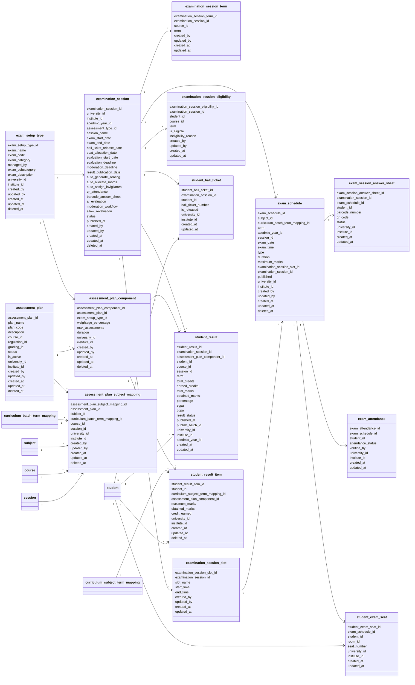

# Examination ER Connections (exam_setup_type to student_result)

```mermaid
classDiagram
    direction LR

    exam_setup_type "1" --> "*" assessment_plan_component
    exam_setup_type "1" --> "*" examination_session

    assessment_plan "1" --> "*" assessment_plan_component
    assessment_plan "1" --> "*" assessment_plan_subject_mapping

    curriculum_batch_term_mapping "1" --> "*" assessment_plan_subject_mapping
    subject "1" --> "*" assessment_plan_subject_mapping
    course "1" --> "*" assessment_plan_subject_mapping
    session "1" --> "*" assessment_plan_subject_mapping

    examination_session "1" --> "*" examination_session_term
    examination_session "1" --> "*" examination_session_slot
    examination_session "1" --> "*" examination_session_eligibility
    examination_session "1" --> "*" exam_schedule
    examination_session "1" --> "*" student_hall_ticket
    examination_session "1" --> "*" student_result

    examination_session_slot "1" --> "*" exam_schedule
    exam_schedule "1" --> "*" student_exam_seat
    exam_schedule "1" --> "*" exam_attendance
    exam_schedule "1" --> "*" exam_session_answer_sheet

    assessment_plan_component "1" --> "*" student_result
    assessment_plan_component "1" --> "*" student_result_item

    curriculum_subject_term_mapping "1" --> "*" student_result_item
    student "1" --> "*" student_result
    student "1" --> "*" student_result_item
    student "1" --> "*" student_hall_ticket
    student "1" --> "*" student_exam_seat

    class exam_setup_type {
        exam_setup_type_id
        exam_name
        exam_code
        exam_category
        managed_by
        exam_subcategory
        exam_description
        university_id
        institute_id
        created_by
        updated_by
        created_at
        updated_at
        deleted_at
    }

    class assessment_plan {
        assessment_plan_id
        plan_name
        plan_code
        description
        course_id
        regulation_id
        grading_id
        status
        is_active
        university_id
        institute_id
        created_by
        updated_by
        created_at
        updated_at
        deleted_at
    }

    class assessment_plan_component {
        assessment_plan_component_id
        assessment_plan_id
        exam_setup_type_id
        weightage_percentage
        max_assessments
        duration
        university_id
        institute_id
        created_by
        updated_by
        created_at
        updated_at
        deleted_at
    }

    class assessment_plan_subject_mapping {
        assessment_plan_subject_mapping_id
        assessment_plan_id
        subject_id
        curriculum_batch_term_mapping_id
        course_id
        session_id
        university_id
        institute_id
        created_by
        updated_by
        created_at
        updated_at
        deleted_at
    }

    class examination_session {
        examination_session_id
        university_id
        institute_id
        acedmic_year_id
        assessment_type_id
        session_name
        exam_start_date
        exam_end_date
        hall_ticket_release_date
        seat_allocation_date
        evaluation_start_date
        evaluation_deadline
        moderation_deadline
        result_publication_date
        auto_generate_seating
        auto_allocate_rooms
        auto_assign_invigilators
        qr_attendance
        barcode_answer_sheet
        ai_evaluation
        moderation_workflow
        allow_revaluation
        status
        published_at
        created_by
        updated_by
        created_at
        updated_at
        deleted_at
    }

    class examination_session_term {
        examination_session_term_id
        examination_session_id
        course_id
        term
        created_by
        updated_by
        created_at
        updated_at
    }

    class examination_session_slot {
        examination_session_slot_id
        examination_session_id
        slot_name
        start_time
        end_time
        created_by
        updated_by
        created_at
        updated_at
    }

    class examination_session_eligibility {
        examination_session_eligibility_id
        examination_session_id
        student_id
        course_id
        term
        is_eligible
        ineligibility_reason
        created_by
        updated_by
        created_at
        updated_at
    }

    class exam_schedule {
        exam_schedule_id
        subject_id
        curriculum_batch_term_mapping_id
        term
        acedmic_year_id
        session_id
        exam_date
        exam_time
        type
        duration
        maximum_marks
        examination_session_slot_id
        examination_session_id
        published
        university_id
        institute_id
        created_by
        updated_by
        created_at
        updated_at
        deleted_at
    }

    class student_hall_ticket {
        student_hall_ticket_id
        examination_session_id
        student_id
        hall_ticket_number
        is_released
        university_id
        institute_id
        created_at
        updated_at
    }

    class student_exam_seat {
        student_exam_seat_id
        exam_schedule_id
        student_id
        room_id
        seat_number
        university_id
        institute_id
        created_at
        updated_at
    }

    class exam_attendance {
        exam_attendance_id
        exam_schedule_id
        student_id
        attendance_status
        verified_by
        university_id
        institute_id
        created_at
        updated_at
    }

    class exam_session_answer_sheet {
        exam_session_answer_sheet_id
        examination_session_id
        exam_schedule_id
        student_id
        barcode_number
        qr_code
        status
        university_id
        institute_id
        created_at
        updated_at
    }

    class student_result {
        student_result_id
        examination_session_id
        assessment_plan_component_id
        student_id
        course_id
        session_id
        term
        total_credits
        earned_credits
        total_marks
        obtained_marks
        percentage
        sgpa
        cgpa
        result_status
        published_at
        publish_batch_id
        university_id
        institute_id
        acedmic_year_id
        created_at
        updated_at
    }

    class student_result_item {
        student_result_item_id
        student_id
        curriculum_subject_term_mapping_id
        assessment_plan_component_id
        maximum_marks
        obtained_marks
        credit_earned
        university_id
        institute_id
        created_at
        updated_at
        deleted_at
    }
```
